<!-- R Commander Markdown Template -->

Replace with Main Title
=======================

### Your Name

### 2017-02-14


```r
> names(White_wines) <- make.names(names(White_wines))
```


```r
> with(White_wines, Hist(alcohol, scale="frequency", breaks="Sturges", 
+   col="darkgray"))
```

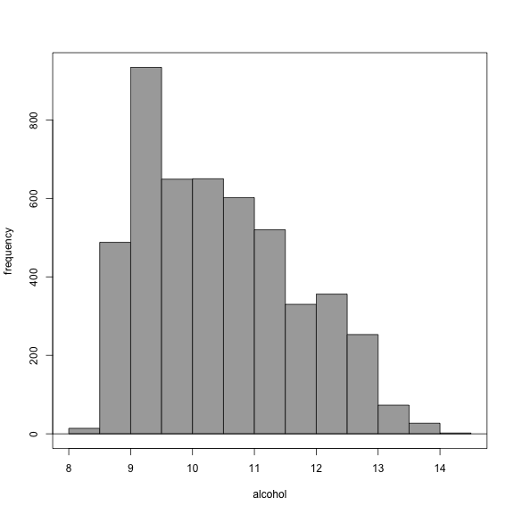


```r
> with(White_wines, Hist(chlorides, scale="frequency", breaks="Sturges", 
+   col="darkgray"))
```


```r
> with(White_wines, Hist(chlorides, scale="frequency", breaks="Sturges", 
+   col="darkgray"))
```


```r
> with(White_wines, Hist(chlorides, scale="frequency", breaks="Sturges", 
+   col="darkgray"))
```

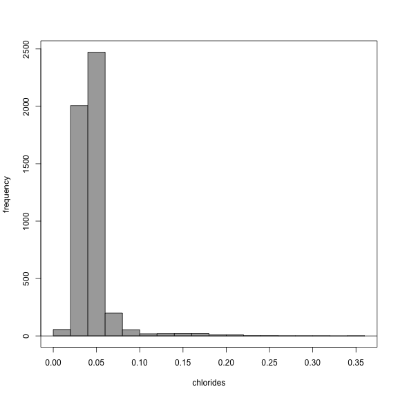


```r
> with(White_wines, Hist(citric.acid, scale="frequency", breaks="Sturges", 
+   col="darkgray"))
```

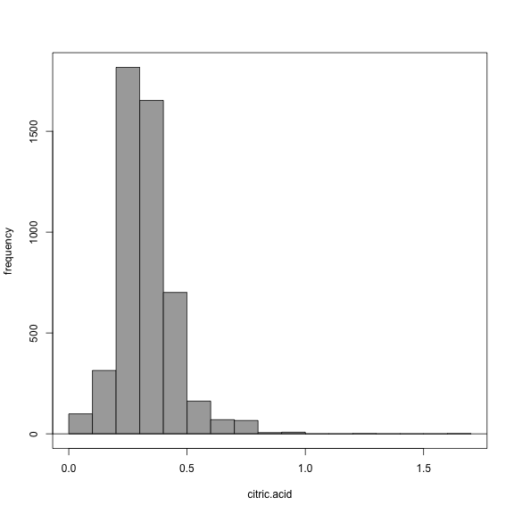


```r
> with(White_wines, Hist(density, scale="frequency", breaks="Sturges", 
+   col="darkgray"))
```

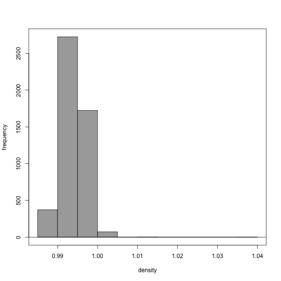


```r
> with(White_wines, Hist(fixed.acidity, scale="frequency", breaks="Sturges", 
+   col="darkgray"))
```

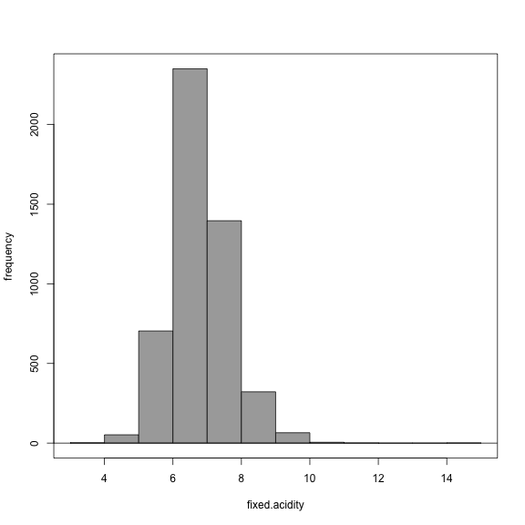


```r
> with(White_wines, Hist(free.sulfur.dioxide, scale="frequency", 
+   breaks="Sturges", col="darkgray"))
```

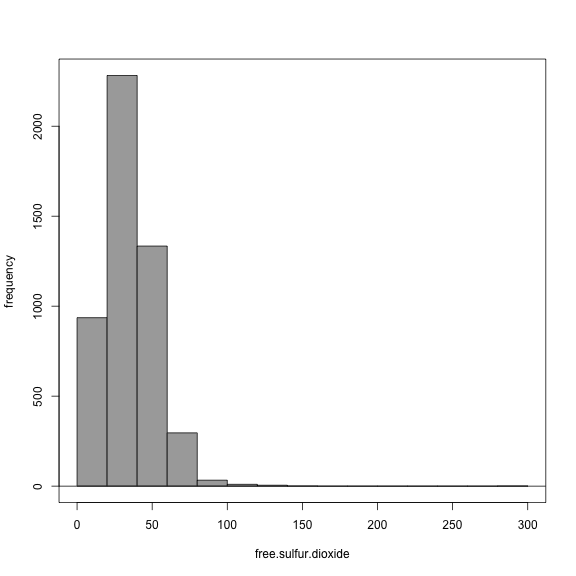


```r
> with(White_wines, Hist(pH, scale="frequency", breaks="Sturges", 
+   col="darkgray"))
```

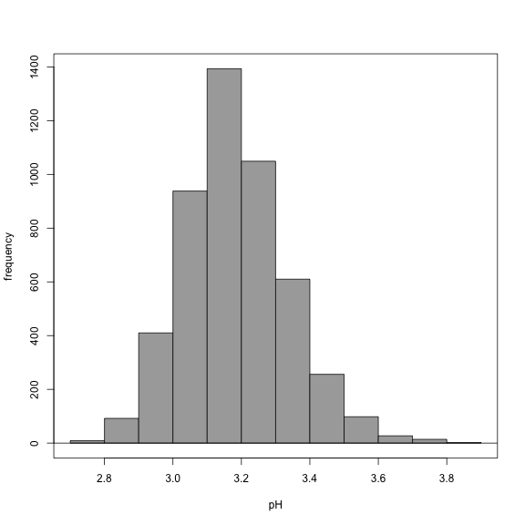


```r
> with(White_wines, Hist(quality, scale="frequency", breaks="Sturges", 
+   col="darkgray"))
```

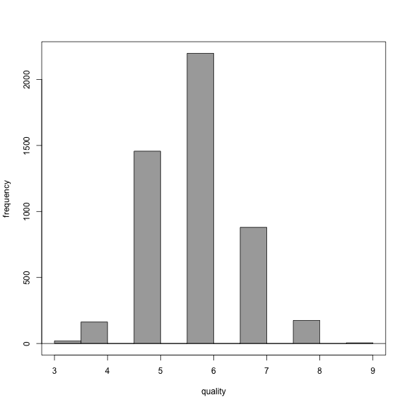


```r
> with(White_wines, Hist(residual.sugar, scale="frequency", breaks="Sturges", 
+   col="darkgray"))
```

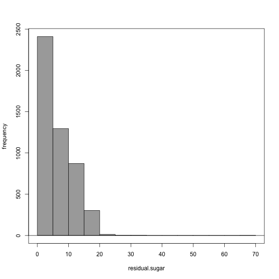


```r
> with(White_wines, Hist(sulphates, scale="frequency", breaks="Sturges", 
+   col="darkgray"))
```

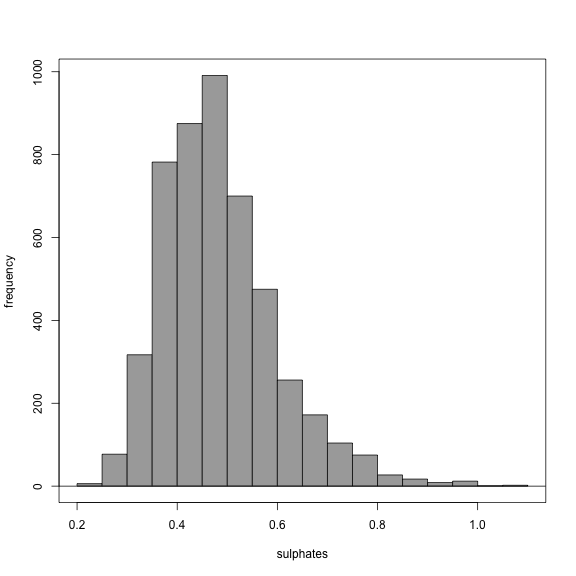


```r
> with(White_wines, Hist(total.sulfur.dioxide, scale="frequency", 
+   breaks="Sturges", col="darkgray"))
```

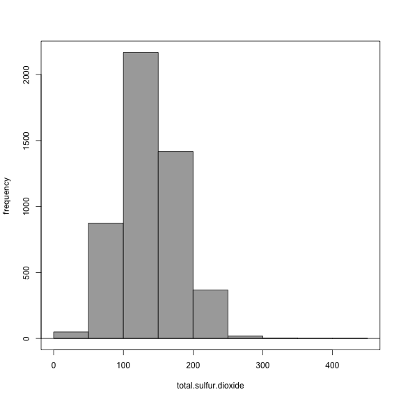


```r
> with(White_wines, Hist(volatile.acidity, scale="frequency", 
+   breaks="Sturges", col="darkgray"))
```

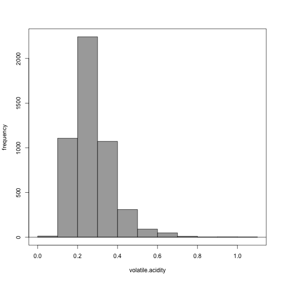


```r
> with(White_wines, Hist(volatile.acidity, scale="frequency", 
+   breaks="Sturges", col="darkgray"))
```


